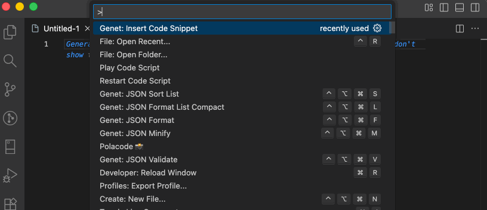

````markdown

# Genet: Code Snippet

Easily insert code snippets from configurable folders into your active editor. Features multi-folder support, live preview, keyboard navigation, and pagination for large snippet collections.

## Demo



*Add a GIF here showing the extension in action*

## Features

- 📁 **Multiple Snippet Folders** - Configure and use multiple folders with recursive subfolder support
- 👁️ **Live Preview** - See snippet content before inserting with arrow key navigation
- ⌨️ **Keyboard Navigation** - Full keyboard support with arrow keys, Enter to select, Esc to cancel
- 📄 **Syntax Highlighting** - Automatic syntax highlighting for 20+ languages
- 🔄 **Pagination** - Efficiently browse large collections with 50 items per page
- ♿ **Accessibility** - Full keyboard support and screen reader compatibility
- 🎯 **Smart Insertion** - Insert at cursor, replace selection, or open in new file

## Quick Start

### 1. Configure Snippet Folders

Open VS Code settings (Cmd+,) and configure `genetCodeSnippet.snippetFolders`:

```json
{
  "genetCodeSnippet.snippetFolders": [
    "/path/to/your/snippets",
    "/path/to/more/snippets",
    "/workspace/shared-snippets"
  ]
}
```

### 2. Run the Command

Press **Cmd+Shift+P** and type **"Genet"** to run `Genet: Insert Code Snippet`

### 3. Select and Insert

- Use **↑↓** arrows to navigate
- Press **Enter** to insert
- Press **Esc** to cancel
- Use **Next/Previous Page** for large collections

## Usage

The extension creates a searchable list of all files in your configured folders:

1. **Navigate** with arrow keys (↑↓)
2. **Preview** appears below as you navigate
3. **Insert** by pressing Enter
4. **Page through** large folders with pagination buttons

### Folder Path Display

Each snippet shows:
- **Filename** in normal text (e.g., `react-hook.ts`)
- **Folder and path** in grey italic below (e.g., `snippets/hooks/react-hook.ts`)

## Configuration

### `genetCodeSnippet.snippetFolders` (Required)

Array of paths to folders containing code snippet files. Each folder can have subfolders.

**Type:** `string[]`  
**Default:** `[]`

**Example:**

```json
{
  "genetCodeSnippet.snippetFolders": [
    "/Users/username/snippets",
    "/workspace/shared-snippets",
    "/projects/templates"
  ]
}
```

## Supported Languages

The extension supports all text-based files and includes syntax highlighting for:

- **Web:** HTML, CSS, JSON, XML, YAML
- **Scripting:** Python, Ruby, PHP, Shell, Bash, Zsh  
- **Compiled:** TypeScript, JavaScript, Java, Go, Rust, C, C++, C#, Swift, Kotlin
- **Markup:** Markdown, SQL

## Keyboard Shortcuts

| Action | Key |
|--------|-----|
| Open Command Palette | Cmd+Shift+P |
| Navigate up/down | ↑ / ↓ |
| Insert snippet | Enter |
| Cancel | Esc |
| Next page | Down arrow on last item |
| Previous page | Up arrow on first item |

## Troubleshooting

### "No snippet folders are accessible"
Check that:
- Folder paths are configured in settings
- Paths exist and you have read permissions
- No typos in folder paths

### "Some folders not accessible"
- Check the warning message
- Verify folder permissions
- Only accessible folders will be used

### "No files found"
- Ensure your snippet folders contain files
- Check that files are text-based (not binary)
- Verify subfolder structure

## Tips

- **Large Collections:** Use pagination (50 items per page) to browse efficiently
- **Organization:** Organize snippets in subfolders for better navigation
- **Multiple Folders:** Combine personal, team, and project-specific snippet folders
- **Naming:** Use descriptive filenames for better searchability

## Requirements

- VS Code 1.105.0 or higher

## License

MIT - See LICENSE file

---

**Enjoy using Genet: Code Snippet!**

````

